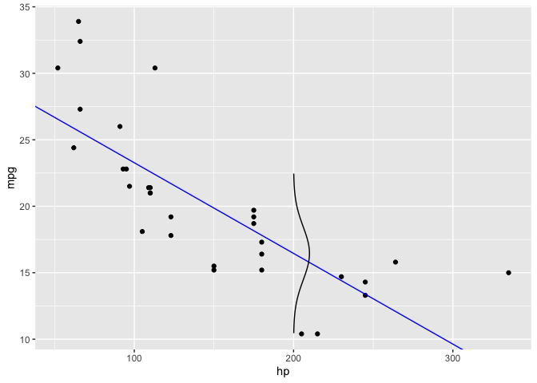

<!-- README.md is generated from README.Rmd. Please edit that file -->

# teacherplot

<!-- badges: start -->
<!-- badges: end -->

The goal of teacherplot is to provide some plots teacher may like if
they are into teaching statistics and realted fields.

## Installation

You can install the development version of teacherplot like so:

``` r
devtools::install_packages("https://github.com/sebastiansauer/teacherplot")
```

## Example

This is a basic example which shows you how to solve a common problem:

``` r
library(teacherplot)
library(tidyverse)
#> ── Attaching packages ─────────────────────────────────────── tidyverse 1.3.2 ──
#> ✔ ggplot2 3.3.6      ✔ purrr   0.3.5 
#> ✔ tibble  3.1.8      ✔ dplyr   1.0.10
#> ✔ tidyr   1.2.1      ✔ stringr 1.4.1 
#> ✔ readr   2.1.3      ✔ forcats 0.5.2 
#> ── Conflicts ────────────────────────────────────────── tidyverse_conflicts() ──
#> ✖ dplyr::filter() masks stats::filter()
#> ✖ dplyr::lag()    masks stats::lag()
lm1 <- lm(mpg ~ hp, data = mtcars)
lm1_pred_200 <- predict(lm1, newdata = tibble(hp = 200))

ggplot(mtcars) +
  aes(x = hp, y = mpg) +
  geom_point() +
  geom_abline(slope = coef(lm1)[2], intercept = coef(lm1)[1], color = "blue") +
  geom_path(
    data = get_norm_density(
      outcome_mean = lm1_pred_200,
      error_sigma = 2,
      z = 3,
      dens_spread_factor = 5e1,
      predictor_value = 200
    ),
    aes(y = outcome, x = norm_dens)
  )
```


